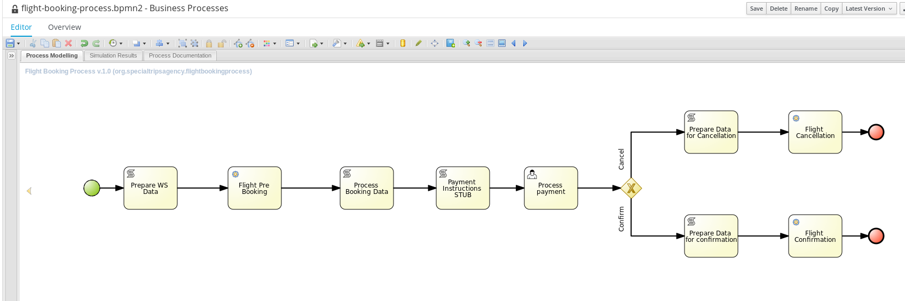

# 1. KIE Server Lab
## 1.1. Goals
* Create a container in KIE Server
* Interacting with KIE Server with REST APIs

# 2. Setup Lab Environment
## 2.1. Add User Roles
The process definition used in this lab has a User task assigned to the agent group. We need to create the proper users and roles that will be able to claim those User Tasks.

Open a terminal window and change to the KIE Server EAP instance bin directory and run the add-user.sh utility:

```bash
cd ~/lab/bpms/kieserver/bin
add-user.sh -u user1 -p bpms -g user,kie-server,rest-task,rest-query,agent -a -s -sc ~/lab/bpms/kieserver/standalone/configuration
add-user.sh -u busadmin -p bpms -g Administrators,analyst,user,kie-server,rest-all -a -s -sc ~/lab/bpms/kieserver/standalone/configuration
```
## 2.2. Lab Assets Overview
This activity involves the use of two lab asset projects that are publicly available in GitHub:

* **advanced-process-development-labs-etc**
Includes various SOAP based services (and supporting domain model) used throughout this course. Also includes a SOAP UI project used in a later lab that load tests the BPM process engine.

* **advanced-process-development-labs**
This project contains various BPM Suite KIE projects, we will use the kie-server-lab-kjar project. This project is cloned and imported into the BPM Central web component of BPM Suite.

## 2.3. Clone, Build and Deploy Web Services project
The process definitions of the labs for this activity make calls to two web services.
It also makes use of a policy-quote domain model.

In this section, you build and deploy the domain model and web services to the JBoss BPM Suite application server.

1. In your new lab environment, open a terminal window as the `jboss` user.
2. Change to the **~/lab** directory, and clone the web services project from GitHub:
  ```
  cd ~/lab
  git clone https://github.com/gpe-mw-training/advanced-process-development-labs-etc.git
  ```
3. Build the project with maven:
  ```
  cd ~/lab/advanced-process-development-labs-etc
  mvn clean install
  ```
4. Deploy the web service .war archives to the JBoss BPM Suite application server:
  ```
  cp flight-service/target/flight-service-1.0.war ~/lab/bpms/bc/standalone/deployments
  cp hotel-service/target/hotel-service-1.0.war ~/lab/bpms/bc/standalone/deployments
  cp data-model/target/data-model-1.0.jar ~/lab/bpms/bc/standalone/deployments/business-central.war/WEB-INF/lib

  ```
5. Restart the Business Central EAP instance.

## 2.4. Review the lab project
Business central is used for the authoring process of business assets. In this lab we will use Business central to view the KIE project (specifically, its process definition).

1. Login as `jboss/bpms` in business central by navigating to `http://localhost:8080/business-central`.
2. Clone the `advanced-process-development-labs` git repository in business central:
  1. Select the **Authoring**>**Administration** menu option.
    
  2. From the **Repositories** menu select the **Clone repository** option.
    
  3. Fill the _Clone Repository_ form with the follosing information:
    * **Repository Name:** bpms-advanced
    * **Organizational Unit:** acme
    * **Git URL:** https://github.com/gpe-mw-training/advanced-process-development-labs.git
    * Leave empty the `user name` and `password` (planner-labs is a public repository).
3. Navigate to **Authoring**>**Project Authoring**
4. The lab repository contains several projects. Select the kie-server-lab-kjar project.
5. Review the flight-booking-process process definition.
  

## 2.5. Review the KIE Server configuration
In the Virtual Machine Business Central acts as the controller of one instance of KIE Server.
Start BPMS and log in to Business Central. Navigate to Deploy -> Execution Servers.
You should see a server template, with one remote server (which in our setup is not really remote), and no containers.
KIE Server is configured using system properties. In our lab setup, these system properties have been added to the JVM startup options in the `standalone.conf` configuration file.
To review these system properties:

1. Open a terminal and read the standalone.conf file:
  ```
  cat ~/lab/bpms/kieserver/bin/standalone.conf | grep org.kie.server

  ```

Analyze the KIE Server configuration switches.

# 3. Clone and build the lab project.
To be able to deploy a kjar on KIE server, we need to build the kjar first. This can be done using Maven, on the command line.

1. If it doesn’t already exist on the filesytem of your lab environment, clone the lab repository from Github:
  ```
  cat ~/lab
  git clone https://github.com/gpe-mw-training/advanced-process-development-labs.git

  ```
2. Build and install the kjar in the local maven repository:
  ```
  cd ~/lab/advanced-process-development-labs/kie-server-lab-kjar
  mvn clean install

  ```

This operation builds a kjar from this kie project and installs it in your local maven repository at: ~/.m2/repository . This kjar is now available to be installed in a container running in our KIE server.

# 4. Deploying to KIE server
As our KIE Server is configured as a managed server, we will use the Business Central console to deploy our container.

Had our KIE Server been un-managed, we would have configured it (along with container deployment within it) through REST calls to the KIE server.

1. Log into Business Central with the `jboss` user, navigate to **Deploy** -> **Execution Servers**.
2. Select the **kie-server-127.0.0.1** server template, and click `Add Container`.
3. In the dialog box, fill in the following values:
  * **Name** : flight-booking-1.0
  * **Group Name** : com.redhat.gpte.bpms-advanced
  * **Artifact Id** : kie-server-lab-kjar
  * **Version** : 1.0
4. To actually `start` the container on KIE Server, make sure the container is selected and click the **Start** button.

# 5. KIE Server REST API
KIE Server comes with a documentation page for the REST API. To view the page, navigate in a browser to http://localhost:8230/kie-server/docs/.

In the following lab we will use the REST API to go through a typical process and task life cycle. We will use curl on the command line to issue REST commands, using JSON as payload and response format.

1. To view the status of the KIE Server:
  ```
  curl -X GET -H "Accept: application/json" --user jboss:bpms http://localhost:8230/kie-server/services/rest/server
  ```
2. To view the containers deployed on the KIE server:
  ```
  curl -X GET -H "Accept: application/json" --user jboss:bpms http://localhost:8230/kie-server/services/rest/server/containers
  ```
3. To see the different process definitions in the container:
  ```
  curl -X GET -H "Accept: application/json" --user jboss:bpms http://localhost:8230/kie-server/services/rest/server/queries/containers/flight-booking-1.0/processes/definitions
  ```
4. To start an instance of the org.specialtripsagency.flightbookingprocess process:
  ```
  curl -X POST -H "Accept: application/json" -H "Content-Type: application/json" --user jboss:bpms -d '{"applicantName":"John", "flight_carrier":"AA", "flight_flightNr":"1256", "flight_travelClass":"E"}' http://localhost:8230/kie-server/services/rest/server/containers/flight-booking-1.0/processes/org.specialtripsagency.flightbookingprocess/instances
  ```
  > The response value of this call is the process instance ID of the process that was started.

5. To get the process instances in a container:
  ```
  curl -X GET -H "Accept: application/json" --user jboss:bpms http://localhost:8230/kie-server/services/rest/server/queries/containers/flight-booking-1.0/process/instances
  ```
REST operations that return lists of process instances or tasks can be filtered, and have support for paging.
For example, to filter on active process instances, and get the first page of the resultset:
  ```
  curl -X GET -H "Accept: application/json" --user jboss:bpms "http://localhost:8230/kie-server/services/rest/server/queries/containers/flight-booking-1.0/process/instances?status=1&page=0"
  ```
The default page size is 10, but this can be changed with the pageSize query parameter:
  ```
  curl -X GET -H "Accept: application/json" --user jboss:bpms "http://localhost:8230/kie-server/services/rest/server/queries/containers/flight-booking-1.0/process/instances?status=1&page=0&pageSize=25"
  ```
6. To get the current state of the process variables of a process instance (instance with ID 1):
  ```
  curl -X GET -H "Accept: application/json" --user jboss:bpms "http://localhost:8230/kie-server/services/rest/server/queries/processes/instances/1/variables/instances"
  ```
7. To get the tasks assigned as a potential owner:
To a group (agent):
  ```
  curl -X GET -H "Accept: application/json" --user jboss:bpms "http://localhost:8230/kie-server/services/rest/server/queries/tasks/instances/pot-owners?groups=agent"
  ```
Or to a individual user (user1):
  ```
  curl -X GET -H "Accept: application/json" --user jboss:bpms "http://localhost:8230/kie-server/services/rest/server/queries/tasks/instances/pot-owners?user=user1"
  ```
8. To claim a task:
1 is the task ID, as returned by the previous call.
  ```
  curl -X PUT -H "Accept: application/json" --user user1:bpms "http://localhost:8230/kie-server/services/rest/server/containers/flight-booking-1.0/tasks/1/states/claimed"
  ```
> Note that this can only be done when authenticating as a user who is a potential owner of the task. If the user is not a potential owner, an exception message is returned.

9. To get the tasks owned by a user:
  ```
  curl -X GET -H "Accept: application/json" --user user1:bpms "http://localhost:8230/kie-server/services/rest/server/queries/tasks/instances/owners"
  ```
This requires to authenticate as the user owning the task.
To filter by status:
  ```
  curl -X GET -H "Accept: application/json" --user user1:bpms "http://localhost:8230/kie-server/services/rest/server/queries/tasks/instances/owners?status=Reserved&status=InProgress"
  ```
With paging:
  ```
  curl -X GET -H "Accept: application/json" --user user1:bpms "http://localhost:8230/kie-server/services/rest/server/queries/tasks/instances/owners?status=Reserved&status=InProgress&page=0"
  ```
10. To start a task:
  ```
  curl -X PUT -H "Accept: application/json" --user user1:bpms "http://localhost:8230/kie-server/services/rest/server/containers/flight-booking-1.0/tasks/1/states/started"
  ```
You can use the tasks owned by user REST call to verify that the status of the task has moved to InProgress
11. To get the values of the task input variables:
  ```
  curl -X GET -H "Accept: application/json" --user user1:bpms "http://localhost:8230/kie-server/services/rest/server/containers/flight-booking-1.0/tasks/1/contents/input"
  ```
  > Note that the response includes task variables for internal use of the BPMS engine (TaskName, NodeName, Skippable, GroupId)

12. To update the output task variables:
  ```
  curl -X PUT -H "Accept: application/json" -H "Content-Type: application/json" -d '{"Status":"Paid"}' --user user1:bpms "http://localhost:8230/kie-server/services/rest/server/containers/flight-booking-1.0/tasks/1/contents/output"
  ```
13. To get the values of the task output variables:
  ```
  curl -X GET -H "Accept: application/json" --user user1:bpms "http://localhost:8230/kie-server/services/rest/server/containers/flight-booking-1.0/tasks/1/contents/output"
  ```
14. To complete a task:
  ```
  curl -X PUT -H "Accept: application/json" --user user1:bpms "http://localhost:8230/kie-server/services/rest/server/containers/flight-booking-1.0/tasks/1/states/completed"
  ```
